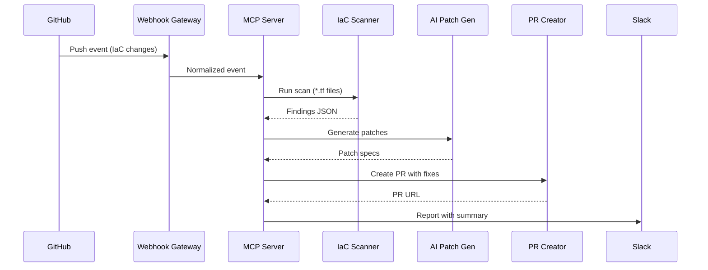

# AutoMCP IaC Security Demo

This demo implements an automated Infrastructure as Code (IaC) security scanning pipeline:

GitHub Push Event → Webhook Gateway → MCP Server (scan + AI patch + PR) → Slack Report

## Architecture



## Setup

### Prerequisites

- Python 3.10+
- GitHub Personal Access Token (scopes: `repo`, `pull_request`)
- Slack Incoming Webhook URL

### Tools recommended
ngrok [this tool allows you to expose your locally running instance to the internet](https://ngrok.com/)
uv [Python package management tool, extremely fast](https://docs.astral.sh/uv/)

### Installation

```bash
# Clone and setup
git clone https://github.com/owenljn/hackathon-devops-demo.git
cd hackathon-devops-demo

# Create virtual environment
python -m venv .venv
source .venv/bin/activate  # Linux/Mac
# .venv\Scripts\activate   # Windows

# Install dependencies
pip install fastapi uvicorn pydantic requests python-dotenv

# Optional: Real IaC scanning tools
pip install checkov  # For real vulnerability scanning
```

### Configuration

```bash
cp .env.example .env
# Edit .env with actual values:
# SLACK_WEBHOOK_URL=slack-webhook-url
# GITHUB_TOKEN=
# GITHUB_REPO=owenljn/hackathon-devops-demo
```

### Optional: ngrok for External Webhooks

```bash
# Install ngrok (https://ngrok.com/)
# In your GitHub repo settings → Webhooks:
# Payload URL: https://abc123.ngrok.io/webhook/github
# Content type: application/json
# Events: Push
```

## Quick Start Demo

```bash
# 1. Start the service
bash scripts/run_local.sh

# 2. In another terminal: Simulate GitHub push event
curl -X POST http://localhost:8080/webhook/github \
  -H "Content-Type: application/json" \
  -d '{
    "repository": {"full_name": "owenljn/hackathon-devops-demo"},
    "ref": "refs/heads/main",
    "after": "abc123def",
    "commits": [{"modified": ["samples/iac/insecure/main.tf"]}]
  }'

# 3. Expected Results:
# - Slack receives message with findings and PR link
# - New PR created with AI-generated security fixes
# - Repo contains "autofix/short-sha" branch with patches
```

## Demo Files

- `samples/iac/insecure/main.tf` - Terraform with intentional security issues
- `scripts/run_local.sh` - Start gateway + MCP server
- `scripts/seed_demo.sh` - Copy sample IaC for testing

## API Endpoints

- `GET /healthz` - Health check
- `POST /webhook/github` - GitHub webhook receiver

## Features

- **Real Tool Integration**: Checkov for vulnerability scanning (with mocks as fallback)
- **AI-Powered Patching**: Template-based fixes for common IaC issues
- **Automated PR Creation**: GitHub API integration for seamless workflow
- **Rich Slack Reporting**: Block Kit messages with actionable links
- **Minimal Dependencies**: Python + requests for reliability

## Local Development

```bash
# With hot reload
python -m uvicorn src.gateway.main:app --reload --port 8080
```

## Docker (Optional)

```bash
docker build -f docker/Dockerfile.api -t hackathon-demo .
docker run -p 8080:8080 --env-file .env hackathon-demo
```

## Extensibility

The MCP server architecture allows easy addition of new tools:
- Additional scanners (Terraform validate, OPA policies)
- Different AI providers (OpenAI, Azure OpenAI)
- Alternative PR destinations (Azure DevOps, GitLab)
- Enhanced reporting (Teams, Discord)
